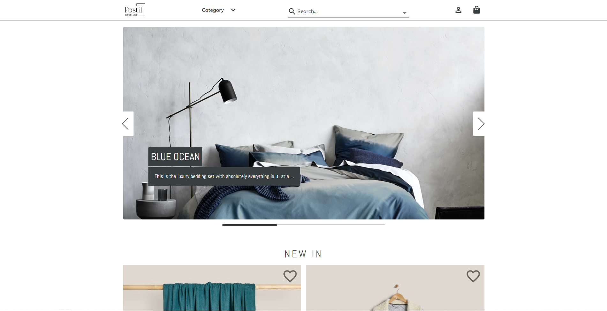

# Online store "Postil' bedding"

It's a finale project on it-courses. We have worked in team with 6 members for about a 2 month and implemented all 
popular functional and
features for online stores

#### Link to deployed project:
https://fp-postil-bedding.herokuapp.com/

#### Link to project presentation:
https://docs.google.com/presentation/d/1CBFV4Z9PBZjipS-x3z4KodsS_i2IgTSlwFx6lEovX9I/edit?usp=sharing

## Technology stack:
1. HTML5
2. JavaScript
3. [React JS](https://uk.reactjs.org/)
4. [Redux toolkit](https://redux-toolkit.js.org/)
5. [Node.js](https://nodejs.org/uk/)
6. [Material UI](https://mui.com/getting-started/installation/)
7. [Formik](https://formik.org/docs/overview)
8. [Yup](https://www.npmjs.com/package/yup)
9. [React Transition Group](https://reactcommunity.org/react-transition-group/)
10. [ESLint](https://eslint.org/)
11. [Husky](https://www.npmjs.com/package/husky)
12. [Helmet](https://www.npmjs.com/package/react-helmet)
13. [Travis CI](https://www.travis-ci.com/)

## Team members:
1. [Daniil Khlyvniuk](https://github.com/Daniil-Khlyvniuk)
2. [Yaroslav Verbitsky](https://github.com/nikolasdelunko)
3. [Darina Otroshenko](https://github.com/OtroshenkoDarina)
4. [Elizabeth Rudaya](https://github.com/lizarudayaa)
5. [Igor Nikonov](https://github.com/IggyDev34)
6. [Vitaliy Gukalov](https://github.com/Vitaliy-1809)
7. [Andriy Litvinenko](https://github.com/Shootka)
8. [Aleksandr Mayboroda](https://github.com/AlexMaybee)

## What tasks were accomplished by team members:

#### Daniil Klyvniuk: 
1. Config prettier / esLint;
2. \**Refaction server for product
   variability;
3. Search products by autocomplete (backend part);
4. Saving images on server;
5. Product filter (backend part);

(**) Initially, we were given a ready-made server and it was planned that we would only do the front-end part. But 
our layout assumed product variability, which was not supported by that server. Now, the same product can have 
different variations in color, size, price, id and amount. Like 
[this one for example](https://fp-postil-bedding.herokuapp.com/product-details/61a653e8253d3605949967ec) - one product with different colors and productId.

This was my first experience with Node.js, noSQL database.
_____

Yaroslav Verbitsky:
1. Page 404
2. UI Catalog page
3. Recently viewed items component
4. Shopping Bag page
5. Shipping Details page
6. Payment Details page
7. Cart component
8. Helmet partially
9. Connection, settings Stripe payments

Elizabeth Rudaya:
1. Error boundary component
2. Loader component
3. Main page - "Popular" section
4. Singal product page - logic and product description
5. User profile page
6. User purchase history
7. "Terms of service' page
8. Project presentation

Vitaliy Gukalov:
1. Basic layout selection for the project
2. Setting up a project build (partly)
3. Site Header (except Categories menu)
4. Search page (partly)
5. Modal window (universal component)
6. Favorites page (including adding favorite icons on cards on all pages)(Redux - partly)
7. Covering project with tests (partly)
8. Adaptive design of all components and pages worked on (using MUI)
9. Project deploy (partly)
10. Managing team work (stand-up calls, mentor cooperation, Trello managing, project defense speaker)

Andriy Litvinenko:
1. Make validation schemes for forms.
2. Login/registration form layout.
3. Carousel (universal component).
4. Infinity scroll for products.
5. Make static pages from Q&A (universal component).
6. Adaptive design of components and pages(using MUI).
7. Covering project with tests (partly).

Aleksandr Mayboroda:
1. Footer - styles, adaptive (partly).
2. Subscribe form - logic and styles.
3. Auth and registration form - adaptive (partly) and logic.
4. Redux structure, slices - filters, links (footer), user, settings (default values ...).
5. Filters page - adaptive and styling (partly), logic.
6. Cart logic code new version - refactoring old one.
7. Server debugging - solving a bugs in code (some functional).
8. Helmet settings.
9. Code refactoring (partly).
10. Information Snacks.

Darina Otroshenko and Igor Nikonov:
* Originally started with a team, but decided to leave the project

